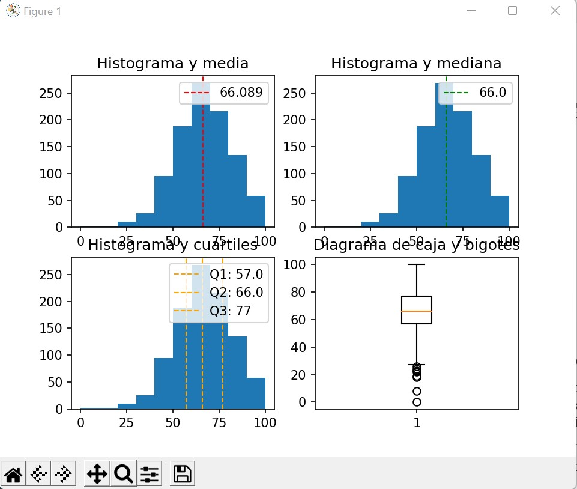

# Una-serie-de-notas

Mi dirección de GitHub para este repositorio es la siguiente: [GitHub](https://github.com/andmansim/Una-serie-de-notas.git)
https://github.com/andmansim/Una-serie-de-notas.git

En este repositorio voy a explicar como analizar datos estadísticamente.

# Explicar una serie de notas
En una clase hay 1000 estudiantes con unas series de notas de los exámenes que hicieron, esos exámenes son matemáticas, expresión escrita y comprensión lectora. Con todos estos datos los vamos a analizar estadísticamente, y se van a explicar cada paso y el porqué de ese procedimiento.

# Abrir y obtener datos del fichero CSV
Comenzamos por abrir el fichero .csv en el fichero main, que es un DataSet, lo cual lo sabemos por su gran cantidad de columnas y filas. Para abrirlo, primero necesitamos importar la librería pandas, que la importaremos como pd. 
```
import pandas as pd
``` 
La librería pandas es una librería de Python especializada en el manejo y análisis de estructuras de datos. Sus usos principales son: definir nuevas estructuras de datos basadas en arrays(listas) de la librería NumPy, permite leer y escribir ficheros en formato CSV, Excel y bases de datos SQL, permite acceder a datos mediante sus índices o nombres de filas y columnas. También podemos reordenar, dividir y combinar datos, trabajar con series temporales y, por último, realiza operaciones de manera eficiente. 
NumPy es una librería especializada en el cálculo numérico y en el análisis de datos, especialmente para un gran volumen de datos. Además, nos permite trabajar con arrays/listas, que sirve para representar datos de un mismo tipo en varias dimensiones, al igual que es muy fácil manipular dichos datos. En este ejercicio, no lo usaremos, dado que el manejo de datos lo haremos mediante métodos creados por nosotros.
Tras esta breve explicación de para que sirve esta librería, vamos a ver cómo podemos obtener y trabajar con los datos del DataSet. 
Primero debemos de leer el DataSet, para ello lo haremos de la siguiente manera:
```
df = pd.read_csv('StudentsPerformance.csv', delimiter= ',', encoding= 'UTF-8' )
``` 
Creamos una variable que va a ser a la que llamemos cuando queramos trabajar con este fichero CSV. Después ponemos la librería pandas, que hemos nombrado anteriormente como pd, y el .read_csv(‘StudentsPerformance.csv’, delimiter = ‘,’, encoding=’UTF-8’ ). El read_csv es para leer el fichero CSV. Luego ponemos su nombre para poder llamarlo, el delimiter nos indica cómo están separados los parámetros, en este caso será una coma y el enconding es para trasformar todo a UTF-8, para que Python sea capaz de leerlo.
Si lo ejecutamos obtenemos:

     gender race/ethnicity parental level of education  ... math score reading score  writing score
0    female        group B           bachelor's degree  ...         72            72             74
1    female        group C                some college  ...         69            90             88
2    female        group B             master's degree  ...         90            95             93
3      male        group A          associate's degree  ...         47            57             44
4      male        group C                some college  ...         76            78             75
..      ...            ...                         ...  ...        ...           ...            ...
995  female        group E             master's degree  ...         88            99             95
996    male        group C                 high school  ...         62            55             55
997  female        group C                 high school  ...         59            71             65
998  female        group D                some college  ...         68            78             77
999  female        group D                some college  ...         77            86             86

(Los tres puntos los pone para no mostrar todos los datos, dado que en este caso son demasiados para enseñarlos por pantalla)
Podemos observar que tenemos muchas columnas, con el género, grupo, curso, etc. Pero a nosotros nos interesa las notas de todo el centro para poder calcular los datos estadísticos. 
Crearemos una nueva variable df_new, con solo los datos importantes para la estadística:
```
df_new = pd.DataFrame({'math score': df['math score'], 'reading score': df['reading score'], 'writing score': df['writing score']})
``` 
Usaremos pandas para crear un Dataframe, que es muy útil para el manejo de datos en formato tabla. Para ello se lo debemos pasar los datos como un diccionario, indicando el nombre de las columnas, como 'math score'.
Obtenemos:
     math score  reading score  writing score
0            72             72             74
1            69             90             88
2            90             95             93
3            47             57             44
4            76             78             75
..          ...            ...            ...
995          88             99             95
996          62             55             55
997          59             71             65
998          68             78             77
999          77             86             86

# Análisis de datos
Tras esto, comenzaremos a analizar los datos estadísticamente, por ejemplo, de las notas de matemáticas, el math score. Para trabajar con ellas, crearemos una clase llamada JPEstadisticas, con el parámetro df_new[‘math score’], (sabemos que el df_new es el nombre del DataFrame que hemos creado previamente, y los corchetes con el math score, es para indicarle que nos vamos a centrar en la columna math score y que coja los datos de ahí, ignorando el resto del DataFrame. 
```
#--- ANALISIS DE UNA CARACTERISTICA ---
stats = jmp.JMPEstadisticas(df_new['math score'])
stats.analisisCaracteristica()
```
Antes de explicar stats.analisisCaracteristica(), vamos a empezar por el principio de la clase JMPEstadisticas.
El desarrollo de dicha clase se hará en el fichero clases.py. Comenzaremos escribiendo el nombre de la clase y su constructor.
```
class JMPEstadisticas:
    def __init__(self,caracteristica):
        self.caracteristica = caracteristica #columna notas
```
self.caracteristica va a ser el atributo que contenga a la columna df[‘math score’].

# Media aritmética
La media aritmética es el valor promedio de un conjunto de datos numéricos, en nuestro caso las notas de matemáticas, y se calcula sumando todos los conjuntos de valores y dividiéndolo entre el número total de valores.  
Pasos: 

1º Creamos un método llamado calculoMediaAritmetica, con el parámetro self. 

2º Establecemos una variable n que nos va a contar todos los datos que tenemos en nuestro DataFrame. Esto lo hará mediante la función .count()

3º Inicializamos las variables sumaValoresObservaciones y mediaAritmetica, las cuales las inicializaremos con un cero para llamarlas más adelante.

4º Creamos un bucle que nos vaya sumando cada fila de nuestra columna, es decir, que nos sume todas las notas que tenemos y nos guardará el valor final en la variable sumaValoresObservaciones.

5º Calculamos la media, que es la división de la suma de todas las notas, nuestros valores, y lo dividimos entre el número total de ellos. Lo guardamos en la variable mediaAritmetica.

6º El método nos devolverá el valor de la media.

```
def calculoMediaAritmetica(self):

        n = self.caracteristica.count() # 1000 datos para analizar
        sumaValoresObservaciones = 0
        mediaAritmetica = 0
        for valorObservacion in self.caracteristica:
            sumaValoresObservaciones = sumaValoresObservaciones + valorObservacion

        mediaAritmetica = sumaValoresObservaciones / n
        return mediaAritmetica
```

# Mediana
La mediana es el valor que ocupa el lugar central de todos los datos cuando estos están ordenados de menor a mayor.
Pasos: 

1º Definimos el método calculoMediana y le pasamos el parámetro self.

2º Creamos la variable mediana, la igualamos a cero para usarla posteriormente, y la variable característica que se va a encargar de ordenar los valores de menor a mayor. Mediante la función .sort_values(), que además de ordenar los valores de la columna math score. También usaremos .resert_index(drop=True), para que nos resete los índices de cada valor.

Así es como se vería la variable característica:
<<<
0        0
1        8
2       18
3       19
4       22
      ...
995    100
996    100
997    100
998    100
999    100
>>>

3º Volvemos a contar los valores, dado que, al haber creado la variable n dentro del método de la media, no la reconoce. Por eso volvemos a hacer todo de nuevo.

4º Vamos a calcular la mediana, el problema de la mediana es que debemos de mirar si los datos son pares o impares. Porque si son pares, para calcular el dato de la posición central debemos dividir n/2, lo cual nos dará dos valores que están en dicha posición dependiendo de donde contemos. Así que debemos de hacer la media entre ellos, para calcularnos su valor. Pongamos un ejemplo sencillo, tenemos los siguientes valores:  1, 3, 5, 8, 2, 9. Los ordenamos de menos a mayor:  1, 2, 3, 5, 8, 9. Tenemos 6 datos, entonces el valor de la posición central será el que se encuentre en la posición 3 (6/2). Si empezamos a contar por la izquierda dará que el valor es 3, sin embargo, si empezamos por la derecha el valor será 5. Por ello, se realizará la media de ambos números, (3 + 5) / 2 = 4. Si n es impar tan solo sería hacer la división de n / 2. 

5º Vemos si el resto es igual a cero, para ver si es par o impar. 

6º Par: Establece el rango (la posición del valor central) y rangoPython (la posición del valor central en Python, es dicha posición, pero un número menos, dado que el índice de nuestros datos empieza en cero, no en uno). Y buscamos los valores que corresponden a esas posiciones en nuestra columna de notas. Después calculamos la mediana.

7º Impar: para que nos salga exacto a n le sumamos 1 y lo dividimos entre dos, hallando así la posición del valor central y calculamos como sería en Python, rangoPython.

8º Este método nos devuelve una lista con la mediana y el rango.
```
def calculoMediana(self):
        mediana = 0
        caracteristica = self.caracteristica.sort_values() #ordena valores
        caracteristica = caracteristica.reset_index(drop=True)
        n = self.caracteristica.count()
        par = False;
        if (n % 2 == 0):
            print("La cantidad de observaciones es par.")
            par = True

        if par:
            rango = (n / 2); 
            print("RANGO = "+str(rango))
            rangoPython = rango-1 
            valor1 = caracteristica[rangoPython] 
            valor2 = caracteristica[rangoPython+1]
            mediana = valor1 +((valor2-valor1)/2)
        else:
            rango = ((n + 1) / 2)
            rangoPython = rango - 1
            mediana = caracteristica[rangoPython]

        return [mediana, rango]
```

# Moda
La moda, es el valor que más se repite de todos nuestros datos. Para calcularlo usaremos Counter, una clase que le pasaremos la columna de math score para que nos agrupe los datos en un diccionario y así podamos ver cuál es el mayor. Pero antes debemos de importar:
```
from collections import Counter
```
Para poder usarlo. Así creamos el método calculoModa, con el parámetro self y nos devolverá moda, es decir el diccionario con los datos agrupados.
```
def calculoModa(self):
        moda = Counter(self.caracteristica)
        return moda
```
```
<<<
Counter({65: 36, 62: 35, 69: 32, 59: 32, 73: 27, 61: 27, 71: 26, 67: 26, 63: 26, 68: 26, 58: 25, 74: 25, 66: 24, 53: 24, 77: 24, 81: 22, 79: 22, 76: 21, 75: 21, 64: 20, 72: 18, 54: 18, 70: 18, 57: 18, 55: 18, 82: 18, 52: 18, 49: 17, 80: 17, 60: 16, 87: 16, 88: 15, 50: 15, 78: 14, 85: 14, 47: 11, 46: 11, 51: 11, 84: 11, 48: 11, 40: 10, 44: 9, 56: 9, 45: 9, 91: 9, 90: 8, 83: 8, 86: 8, 100: 7, 94: 7, 97: 6, 41: 6, 42: 6, 89: 6, 92: 6, 43: 5, 35: 5, 39: 4, 37: 4, 93: 4, 38: 3, 98: 3, 99: 3, 96: 3, 29: 3, 32: 3, 30: 2, 27: 2, 34: 2, 95: 2, 36: 2, 18: 1, 33: 1, 0: 1, 22: 1, 28: 1, 24: 1, 26: 1, 19: 1, 23: 1, 8: 1})
>>>
```

# Varianza y Desviación típica
La varianza es una medida de dispersión que representa cuanto varían los datos respecto a la media. Se calcula de la siguiente manera: ∑(valores(math score)- media)^2/n. A cada valor de math score se le resta la media y se le eleva al cuadrado. Después se suman todos ellos y los dividimos entre el número total de valores.
La desviación típica es lo mismo que la varianza, pero en vez de ser en valores tan globales, es respecto a algunos en concreto. Para calcularla solo hay que hacer la raíz de la varianza. 
Pasos: 

1º Definimos el método y ponemos su parámetro self.

2º Calculamos el número total de valores, n. 

3º Calculamos la media aritmética, mediante .mean(), que nos lo hace el propio Python, en la variable mediaAritmetica. Esto es para no tener que llamar a la función que ya nos la calcula. 

4º Inicializamos varianza y c3, siendo ambas igualadas a cero.

5º Hacemos un bucle for, donde a cada valor vemos lo lejos que está de la media, es decir, le restamos la media (en c1), lo multiplicamos por si mismo (c2, esto es lo mismo que elevarlo al cuadrado) y los vamos sumando (c3). 

6º Lo dividimos entre n, recordamos que en Python se tiene en cuenta el cero, por tanto, sería (n – 1), se recoge en la variable varianza.

7º Calculamos la desviación típica, mediante sqrt(varianza), es una función que nos hace la raíz cuadrada de la varianza, obtendremos el valor en la variable desviacionTipica.

8º Nos retorna una lista con la varianza y la desviación típica.

```
def calculoVarianzaDesviacionTipica(self):
        n = self.caracteristica.count()
        mediaAritmetica = self.caracteristica.mean() #media
        varianza = 0
        c3 = 0
        for valorObservacion in self.caracteristica:
            c1 = valorObservacion - mediaAritmetica
            c2 = c1 * c1
            c3 = c3 + c2

        varianza = c3 / (n - 1) # 229.91899799799847

        desviacionTipica = sqrt(varianza) # 15.163080096009468

        return ([varianza, desviacionTipica])
```

# Cuartiles
Los cuartiles son valores que dividen un conjunto de datos en cuatro partes iguales. Tenemos el primer cuartil, indica que el 25% de los datos es menor o igual al valor. El segundo cuartil equivale a la mediana, indica el 50% de los datos es menor o igual al valor. Por último, el tercer cuartil, indica el 75% de los datos es menor o igual al valor.
Pasos:

1º Creamos el método calculoDelosCuartiles con los parámetros self, mediana (le pasamos la mediana calculada previamente) y rangoMediana (es el rango, es decir, el índice con el valor medio de nuestras variables).

2º Ordenamos los datos de menor a mayor y organizamos sus índices. Tal y como hemos hecho en otros métodos. Solo que estos dos últimos se llaman sort_caracteristica en vez de característica.

3º Inicializamos los cuartiles, q1, q2 y q3. q1 y q3 los igualamos a cero, pero q2 = mediana.

4º Calculamos el Q1(cuartil 1). Q1 es el valor que divide a la mitad de nuestros datos, es decir, es el rango / 2. Debemos de ver si este valor es par o impar, si es impar recoge el elemento de la derecha de la mitad de elementos a la izquierda de la mediana. Luego, buscamos el valor de dicha posición en nuestro DataFrame, pero restándole 1 porque empieza en cero.
Si es par, se recoge los valores de los dos elementos centrales en la parte de la izquierda de la media, y lo calcularíamos de la siguiente manera: q1 = (valorMin + ((valorMax - valorMin) / 2) + valorMax) / 2. (valorMin y valorMax ambos son del 25% donde estamos operando y viendo cuál es su valor).

5º Calculamos el Q3(cuartil 3). Primero debemos calcular la longitud de la lista/datos, que lo haremos mediante la función len() de los valores ordenados y le sumaremos uno. Después miramos cuántos elementos hay a la derecha de la media y lo dividiremos por dos, tomando el resto para ver si es par o impar. Si es impar, haremos el rangoMediana(rango) + nbDatosDesdeMediana (los datos de la mitad de la derecha) / 2 y le restaremos 1 para ajustarlo a Python. Además, usaremos la función ceil () de la librería math para redondear el valor al entero siguiente al valor decimal.

Para tener ceil():
```
from math import *
```
Si es par, lo haremos de la siguiente manera: q3 = (valorMin + ((valorMax - valorMin) / 2) + valorMax) / 2, (valorMinQ3 y valorMaxQ3 ambos son del 75% donde estamos operando y viendo cuál es su valor)
```
def calculoDelosCuartiles(self,mediana,rangoMediana):
        sort_caracteristica = self.caracteristica.sort_values()
        sort_caracteristica = sort_caracteristica.reset_index(drop=True)
        q1 = 0
        q2 = mediana
        q3 = 0

        #Cálculo Q1
        restoDivision = rangoMediana%2
        if (restoDivision != 0): #impar
            q1 = sort_caracteristica[((rangoMediana/2)+1)-1]
        else:
            valorMin = sort_caracteristica[((rangoMediana/2)-1)]
            valorMax = sort_caracteristica[(rangoMediana/2)]
            q1 = (valorMin + ((valorMax - valorMin) / 2) + valorMax) / 2

        # Cálculo Q3
        nbdatos = len(sort_caracteristica)+1
        nbDatosDesdeMediana = nbdatos - rangoMediana
        restoDivision = nbDatosDesdeMediana % 2
        if (restoDivision != 0): # impar
            q3 = sort_caracteristica[(rangoMediana+ceil(nbDatosDesdeMediana/2))-1]
        else:
            valorMinQ3 = sort_caracteristica[(rangoMediana+(nbDatosDesdeMediana/2))-1]
            valorMaxQ3 = sort_caracteristica[(rangoMediana+(nbDatosDesdeMediana/2))]
            q3 = (valorMin + ((valorMax - valorMin) / 2) + valorMax) / 2


        return ([q1, q2, q3])
```
# Hallar valores atípicos
Los valores atípicos son valores extremos que nos modifican bastante nuestros datos estadísticos. En el criterio de Turkey, los calcularemos para marcarlos en el histograma boxplot. El modo de calcularlos es probando todas las diferencias entre medias de los datos.
Pasos: 

1º Creamos el método criterioDeTukey con sus parámetros self, primerCuartil, tercerCuartil.

2º Creamos listas que contendrán a los valores atípicos inferiores y superiores, (valoresAberrantesInferiores, valoresAberrantesSuperiores).

3º Ordenamos los valores de menor a mayor, calculamos el rango intercualtil, es decir, la diferencia entre el cuartil 3 y el cuartil 1. 

4º El diagrama boxplot, es un diagrama que consiste en una caja que va desde el cuartil 1 al 3, indicando la mediana y marcando con una recta el resto de valores hasta el máximo y el mínimo. Los atípicos se marcan con puntos. Tras esto, calcularemos el límite inferior(mínimo) y superior(máximo) para saber hasta donde representarlo. 

5º Hacemos un bucle for para averiguar que valores son atípicos, lo haremos comparando cada uno de ellos con los límites, tal que, si el valor a comparar es menor que el límite inferior se añadirá a valoresAberrantesInferiores y si el valor a comparar es mayor que el límite superior se añadirá a valoresAberrantesSuperiores.

6º Los valores atípicos/aberrantes se recogerán en una variable que tendrá ambas listas y nos la retornará
```
def criterioDeTukey(self, primerCuartil, tercerCuartil):

        valoresAberrantesInferiores = []
        valoresAberrantesSuperiores = []
        caracteristica = self.caracteristica.sort_values()
        intercuartil = tercerCuartil - primerCuartil
        print("Inter-cuartil = "+str(intercuartil))
        limiteInferior = primerCuartil - (1.5 * intercuartil)
        limiteSuperior = tercerCuartil + (1.5 * intercuartil)

        for valorObservacion in caracteristica:
            if valorObservacion < limiteInferior:
                valoresAberrantesInferiores.append(valorObservacion)

            if valorObservacion > limiteSuperior:
                valoresAberrantesSuperiores.append(valorObservacion)

        valoresAberrantes = valoresAberrantesInferiores + valoresAberrantesSuperiores

        return (valoresAberrantes)
```
# Visualización
En este método veremos como pintar todos los diagramas necesarios para una mejor representación de estos datos estadísticos. Para ello importaremos la librería matplotlib, es una librería especializada en la creación de gráficos en dos dimensiones y personalizarlos.

```
import matplotlib.pyplot as plt
```
Pasos:

1º Creamos el método con sus parámetros self, media, mediana, cuartil_1, cuartil_2, cuartil_3.

2º Crearemos 4 gráficos:
	-Histograma y media
	-Histograma y mediana
	-Histograma y cuartiles
	-Diagrama de caja y bigotes (boxplot)

3º Creamos el primer gráfico de dimensión 2x2: plt.subplot(2, 2, 1) # el 1 indica que es el gráfico 1 de 4.

4º Creamos un histograma con nuestros datos del DataFrame: plt.hist(self.caracteristica)

5º Ponemos el título del histograma: plt.title("Histograma y media")

6º Pintamos una línea roja, que indica el valor de la media con una etiqueta: plt.axvline(media, color='red', linestyle='dashed', linewidth=1,label = str(media))
Linestyle = estilo de la línea, linewidth= ancho de la línea, media = el valor de la media, label = lo que debe poner en la etiqueta, color = el color de la línea.

7º Le indicamos el lugar donde debe ir la etiqueta: plt.legend(loc='upper right')

Con el resto de histogramas sería igual, salvo cambiando el nombre, el color y el número de gráfico.
El que cambia más es el de boxplot, que en el paso 4º, en vez de plt.hist(), se pone plt.boxplot(), al igual que no hay línea. 
8º Al final ponemos un plt.show(), para que nos lo enseñe por pantalla. 

```
def visualizacion(self, media,mediana,cuartil_1,cuartil_2,cuartil_3):

        plt.subplot(2, 2, 1)
        plt.hist(self.caracteristica)
        plt.title("Histograma y media")
        plt.axvline(media, color='red', linestyle='dashed', linewidth=1,label = str(media))
        plt.legend(loc='upper right')

        plt.subplot(2, 2, 2)
        plt.hist(self.caracteristica)
        plt.title("Histograma y mediana")
        plt.axvline(mediana, color='green', linestyle='dashed', linewidth=1,label = str(mediana))
        plt.legend(loc='upper right')

        plt.subplot(2, 2, 3)
        plt.hist(self.caracteristica)
        plt.title("Histograma y cuartiles")
        plt.axvline(cuartil_1, color='orange', linestyle='dashed', linewidth=1,label = "Q1: "+str(cuartil_1))
        plt.axvline(cuartil_2, color='orange', linestyle='dashed', linewidth=1,label = "Q2: "+str(cuartil_2))
        plt.axvline(cuartil_3, color='orange', linestyle='dashed', linewidth=1,label = "Q3: "+str(cuartil_3))
        plt.legend(loc='upper right')

        plt.subplot(2, 2, 4)
        plt.boxplot(self.caracteristica)
        plt.title("Diagrama de caja y bigotes")
        plt.show()
```
 

# Código principal
Si nos vamos al principio de este documento, hemos explicado el código principal, el main. Pero hasta ahora solo hemos hablado de la clase JMPEstadisticas, por eso es el momento que expliquemos la segunda parte, es decir, stats.analisisCaracteristica().
Aquí el main llama a un método de la clase JMPEstadisticas, que realiza la llamada a todos los métodos de la clase, es decir, es el código principal. 
En este método, nos mostrará:
	El número de datos/filas
	El mínimo, donde ordenamos los valores de menor a mayor, reorganizamos sus índices y cogemos el valor de la fila cero.
	El máximo, haremos lo mismo que en el mínimo, lo único que en vez de coger el que está en la fila cero, cogeremos el que está en la -1, es decir, el último.
	La media, donde llama al método calculoMediaAritmetica()
	La mediana, donde llama al método calculoMediana()
	La moda, donde llama al método calculoModa()
	El rango, resta del máximo y mínimo
	La varianza, donde llama al método calculoVarianzaDesviacionTipica()
	La desviación típica, donde llama al método calculoVarianzaDesviacionTipica(). Y nos muestra el % de cada valor hallado.
	Los cuartiles con sus respectivos %, llamando al método calculoDelosCuartiles(mediana[0],mediana[1]) con sus parámetros, son la mediana y el rango respectivamente.
	Criterios de Turkey, para poder dibujar el diagrama boxplot, llamamos al método criterioDeTukey(cuartiles[0], cuartiles[2]) con sus parámetros, que son los cuartiles 1 y 3.
	Visualización (gráficas), llamamos al método visualizacion(media,mediana[0],cuartiles[0],cuartiles[1],cuartiles[2]) y le pasamos la media, la mediana y los cuartiles 1, 2, y 3
```
def analisisCaracteristica(self):

        print("-----------------------------------------")
        print("      MEDIDA DE TENDENCIA CENTRAL        ")
        print("-----------------------------------------\n")

        print("-- CANTIDAD DE OBSERVACIONES --")
        # -Cantidad de observaciones
        n = self.caracteristica.count()
        print("Cantidad de observaciones = " + str(n))

        print ("\n-- MIN --")
        valoresOrdenados = self.caracteristica.sort_values() #ordena los valores
        valoresOrdenados = valoresOrdenados.reset_index(drop=True) #a los valores ordenados les resetea el índice
        print(valoresOrdenados)
        print("Valor mínimo: "+str(valoresOrdenados[0]))

        print ("\n-- MAX --")
        valoresOrdenados = self.caracteristica.sort_values()
        valoresOrdenados = valoresOrdenados.reset_index(drop=True)
        print("Valor máximo: " + str(valoresOrdenados[len(valoresOrdenados)-1])) # de los totales coge uno menos

        # -Media artimética:
        print("\n-- MEDIA --")
        media = self.calculoMediaAritmetica()
        print("Media aritmética calculada = " + str(media))
        print("> Observaciones: Si todas las observaciones tuvieran el mismo valor (reparto equitativo), este sería " + str(media))

        # -Mediana:
        print("\n-- MEDIANA --")
        mediana = self.calculoMediana()
        print("Mediana calculada = " + str(mediana[0]))
        print("> Observaciones: El valor que se encuentra en el punto medio de las observaciones es:" + str(mediana[0]))
        print("El reparto es: " + str(mediana[1]) + " valores en cada lado de la mediana")

        # -Moda
        print("\n-- MODA --")
        moda = self.calculoModa()
        print(moda)
        print("> Observacions: La moda permite determinar los valores observados con más frecuencia")


        print("\n\n-----------------------------------------")
        print("      MEDIDA DE DISPERSION        ")
        print("-----------------------------------------\n")
        print("-- RANGO --")
        print ("Rango de la serie = "+str(valoresOrdenados[len(valoresOrdenados)-1]-valoresOrdenados[0]))
        varianzaDesviacionTipica = self.calculoVarianzaDesviacionTipica()

        print("\n-- VARIANZA --")
        print("Varianza calculada = " + str(varianzaDesviacionTipica[0]))

        print("\n-- DESVIACION TIPICA --")
        print("Desviación típica calculada = " + str(varianzaDesviacionTipica[1]))
        desviacionTipica = varianzaDesviacionTipica[1]
        print("68 % de los valores de las observaciones se sitúan entre " + str(media - desviacionTipica) + " y " + str(
            media + desviacionTipica))
        print("95 % de los valores de las observaciones se sitúan entre " + str(media - (desviacionTipica * 2)) + " y " + str(
            media + (desviacionTipica * 2)))
        print("99 % de los valores de las observaciones se sitúan entre " + str(media - (desviacionTipica * 3)) + " y " + str(
            media + (desviacionTipica * 3)))

        print("\n\n-----------------------------------------")
        print("      CUARTILES        ")
        print("-----------------------------------------\n")
        cuartiles = self.calculoDelosCuartiles(mediana[0],mediana[1])
        print("25 % de las observaciones tienen un valor inferior a " + str(cuartiles[0]))
        print("50 % de las observaciones tienen un valor inferior a " + str(cuartiles[1]))
        print("75 % de las observaciones tienen un valor inferior a " + str(cuartiles[2]))


        print("\n\n-----------------------------------------")
        print("      DETECCION VALORES ABERRANTES        ")
        print("-----------------------------------------\n")
        print("> Criterios de Tukey")
        valoresAberrantes = self.criterioDeTukey(cuartiles[0], cuartiles[2])
        print("Cantidad de valores aberrantes: " + str(len(valoresAberrantes)))
        print("Valores:" + str(valoresAberrantes))


        print("\n\n-----------------------------------------")
        print("      VISUALIZACION        ")
        print("-----------------------------------------\n")
        print("Generación de las gráficas...")
        self.visualizacion(media,mediana[0],cuartiles[0],cuartiles[1],cuartiles[2])
```

Mostrando todo esto por pantalla:

<<<
     gender race/ethnicity  ... reading score writing score
0    female        group B  ...            72            74
1    female        group C  ...            90            88
2    female        group B  ...            95            93
3      male        group A  ...            57            44
4      male        group C  ...            78            75
..      ...            ...  ...           ...           ...
995  female        group E  ...            99            95
996    male        group C  ...            55            55
997  female        group C  ...            71            65
998  female        group D  ...            78            77
999  female        group D  ...            86            86

[1000 rows x 8 columns]
     math score  reading score  writing score
0            72             72             74
1            69             90             88
2            90             95             93
3            47             57             44
4            76             78             75
..          ...            ...            ...
995          88             99             95
996          62             55             55
997          59             71             65
998          68             78             77
999          77             86             86

[1000 rows x 3 columns]
-----------------------------------------
      MEDIDA DE TENDENCIA CENTRAL
-----------------------------------------

-- CANTIDAD DE OBSERVACIONES --
Cantidad de observaciones = 1000

-- MIN --
0        0
1        8
2       18
3       19
4       22
      ...
995    100
996    100
997    100
998    100
999    100
Name: math score, Length: 1000, dtype: int64
Valor mínimo: 0

-- MAX --
Valor máximo: 100

-- MEDIA --
1000
Media aritmética calculada = 66.089
> Observaciones: Si todas las observaciones tuvieran el mismo valor (reparto equitativo), este sería 66.089

-- MEDIANA --
La cantidad de observaciones es par.
RANGO = 500.0
Mediana calculada = 66.0
> Observaciones: El valor que se encuentra en el punto medio de las observaciones es:66.0
El reparto es: 500.0 valores en cada lado de la mediana

-- MODA --
Counter({65: 36, 62: 35, 69: 32, 59: 32, 73: 27, 61: 27, 71: 26, 67: 26, 63: 26, 68: 26, 58: 25, 74: 25, 66: 24, 53: 24, 77: 24, 81: 22, 79: 22, 76: 21, 75: 21, 64: 20, 72: 18, 54: 18, 70: 18, 57: 18, 55: 18, 82: 18, 52: 18, 49: 17, 80: 17, 60: 16, 87: 16, 88: 15, 50: 15, 78: 14, 85: 14, 47: 11, 46: 11, 51: 11, 84: 11, 48: 11, 40: 10, 44: 9, 56: 9, 45: 9, 91: 9, 90: 8, 83: 8, 86: 8, 100: 7, 94: 7, 97: 6, 41: 6, 42: 6, 89: 6, 92: 6, 43: 5, 35: 5, 39: 4, 37: 4, 93: 4, 38: 3, 98: 3, 99: 3, 96: 3, 29: 3, 32: 3, 30: 2, 27: 2, 34: 2, 95: 2, 36: 2, 18: 1, 33: 1, 0: 1, 22: 1, 28: 1, 24: 1, 26: 1, 19: 1, 23: 1, 8: 1})
> Observacions: La moda permite determinar los valores observados con más frecuencia


-----------------------------------------
      MEDIDA DE DISPERSION
-----------------------------------------

-- RANGO --
Rango de la serie = 100

-- VARIANZA --
Varianza calculada = 229.91899799799847

-- DESVIACION TIPICA --
Desviación típica calculada = 15.163080096009468
68 % de los valores de las observaciones se sitúan entre 50.92591990399053 y 81.25208009600946
95 % de los valores de las observaciones se sitúan entre 35.76283980798107 y 96.41516019201893
-----------------------------------------
      VISUALIZACION
-----------------------------------------

Generación de las gráficas...
>>>



